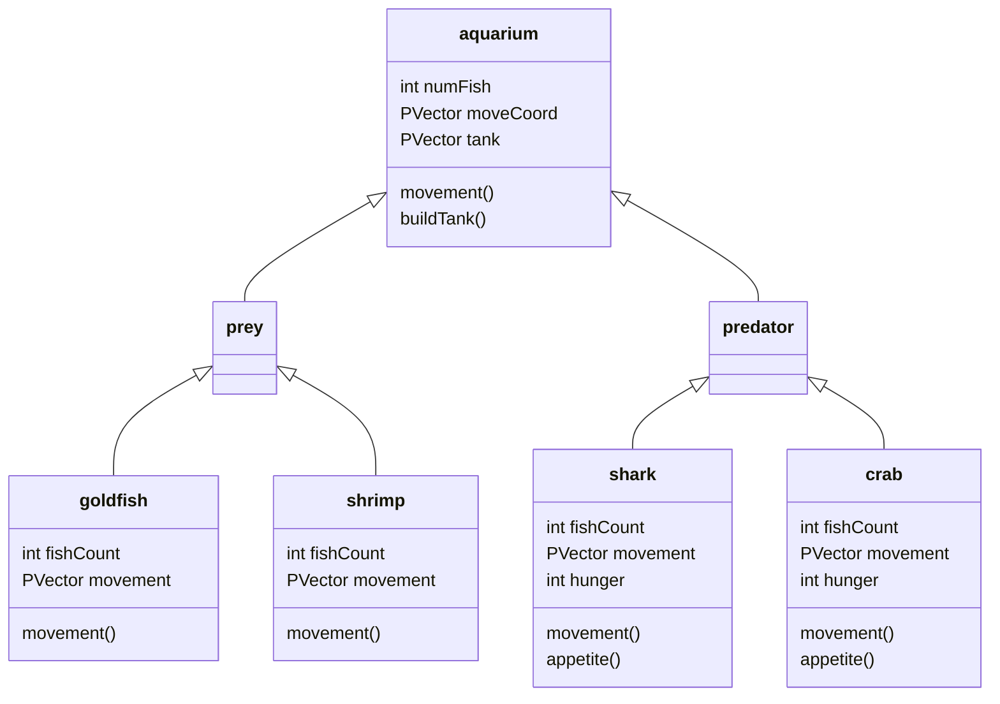

```mermaid
classDiagram
class aquarium {
    int numFish
    PVector moveCoord
    PVector tank

    movement()
    buildTank()

  }

  aquarium <|-- prey

  prey <|-- goldfish
    class goldfish {
      int fishCount
      PVector movement

      movement()
    }

  prey <|-- shrimp
    class shrimp {
      int fishCount
      PVector movement

      movement()
    }


  aquarium <|-- predator

  predator <|-- shark
    class shark {
      int fishCount
      PVector movement
      int hunger

      movement()
      appetite()
    }

  predator <|-- crab
    class crab {
      int fishCount
      PVector movement
      int hunger

      movement()
      appetite()
    }
```
